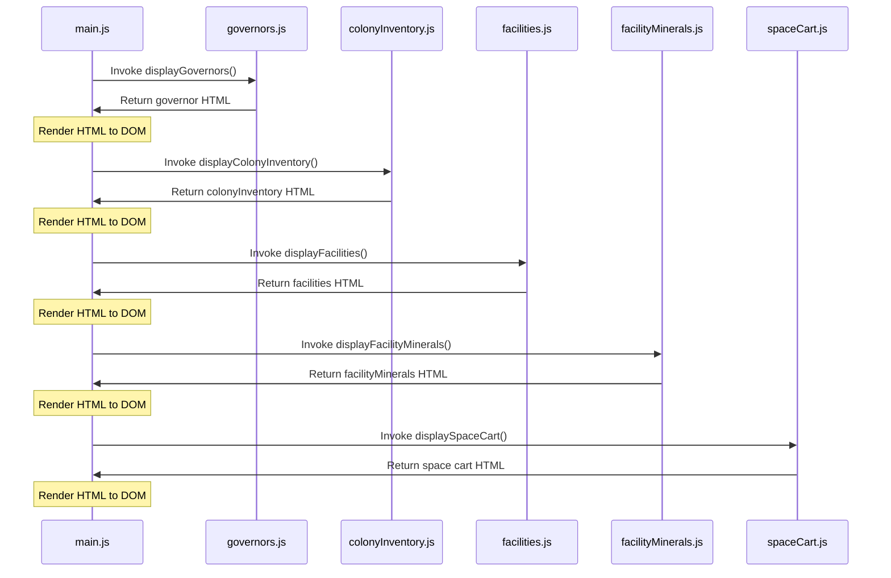

```mermaid
sequenceDiagram
participant main.js
participant governors.js
participant colonyInventory.js
participant facilities.js
participant facilityMinerals.js
participant spaceCart.js


main.js ->> governors.js: Invoke displayGovernors()
governors.js->>main.js: Return governor HTML
note over main.js: Render HTML to DOM

main.js ->> colonyInventory.js: Invoke displayColonyInventory()
colonyInventory.js->>main.js: Return colonyInventory HTML
note over main.js: Render HTML to DOM

main.js ->> facilities.js: Invoke displayFacilities()
facilities.js->>main.js: Return facilities HTML
note over main.js: Render HTML to DOM

main.js ->> facilityMinerals.js: Invoke displayFacilityMinerals()
facilityMinerals.js->>main.js: Return facilityMinerals HTML
note over main.js: Render HTML to DOM

main.js ->> spaceCart.js: Invoke displaySpaceCart()
spaceCart.js->>main.js: Return space cart HTML
note over main.js: Render HTML to DOM


```