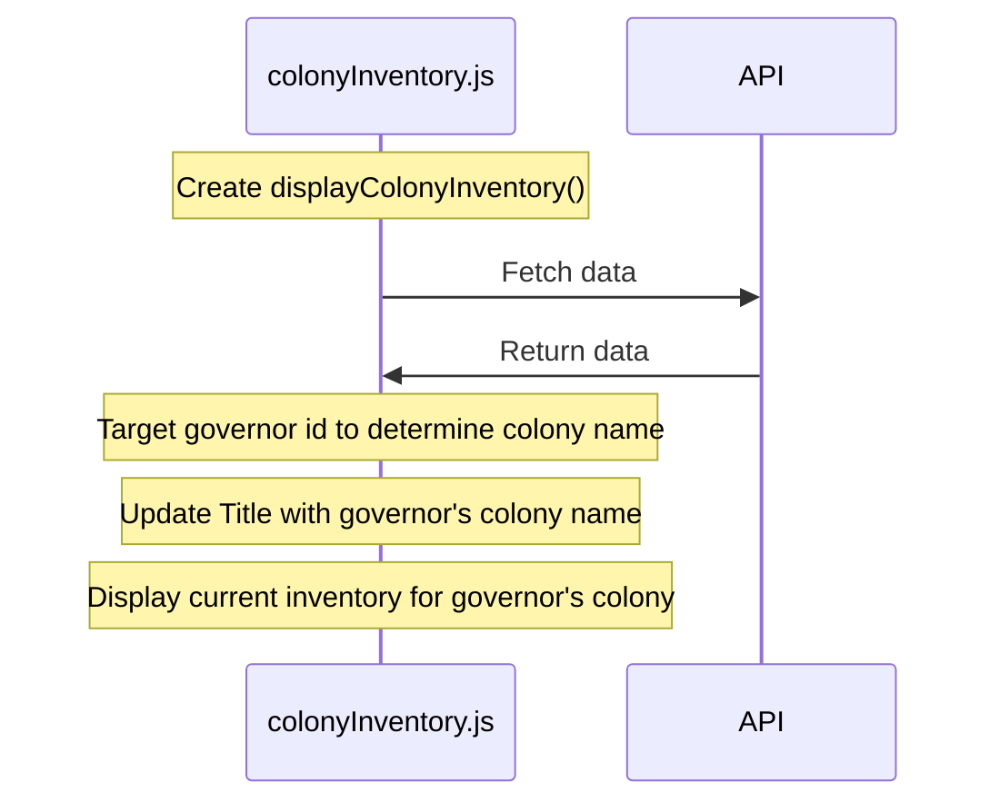

```mermaid
sequenceDiagram
participant colonyInventory.js
participant API

note over colonyInventory.js: Create displayColonyInventory()
colonyInventory.js ->> API: Fetch data
API->>colonyInventory.js: Return data
note over colonyInventory.js: Target governor id to determine colony name
note over colonyInventory.js: Update Title with governor's colony name
note over colonyInventory.js: Display current inventory for governor's colony

```