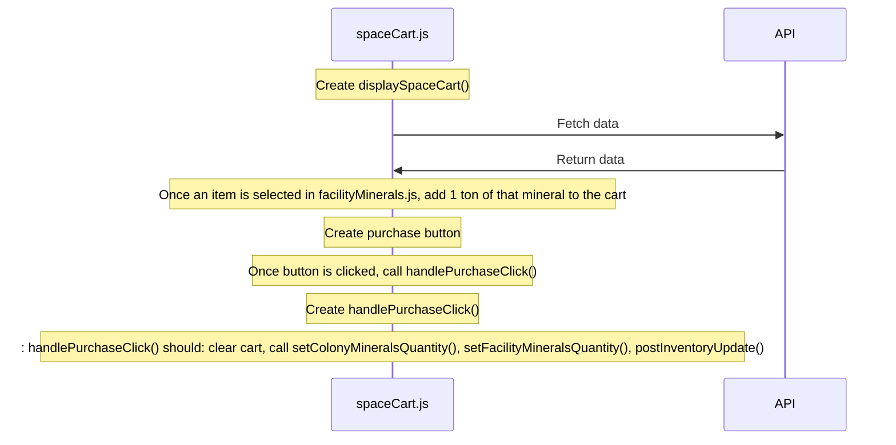

```mermaid
sequenceDiagram
participant spaceCart.js
participant API

note over spaceCart.js: Create displaySpaceCart()
spaceCart.js ->> API: Fetch data
API->>spaceCart.js: Return data

note over spaceCart.js: Once an item is selected in facilityMinerals.js, add 1 ton of that mineral to the cart
note over spaceCart.js: Create purchase button
note over spaceCart.js: Once button is clicked, call handlePurchaseClick()
note over spaceCart.js: Create handlePurchaseClick()
note over spaceCart.js: : handlePurchaseClick() should: clear cart, call setColonyMineralsQuantity(), setFacilityMineralsQuantity(), postInventoryUpdate()
```